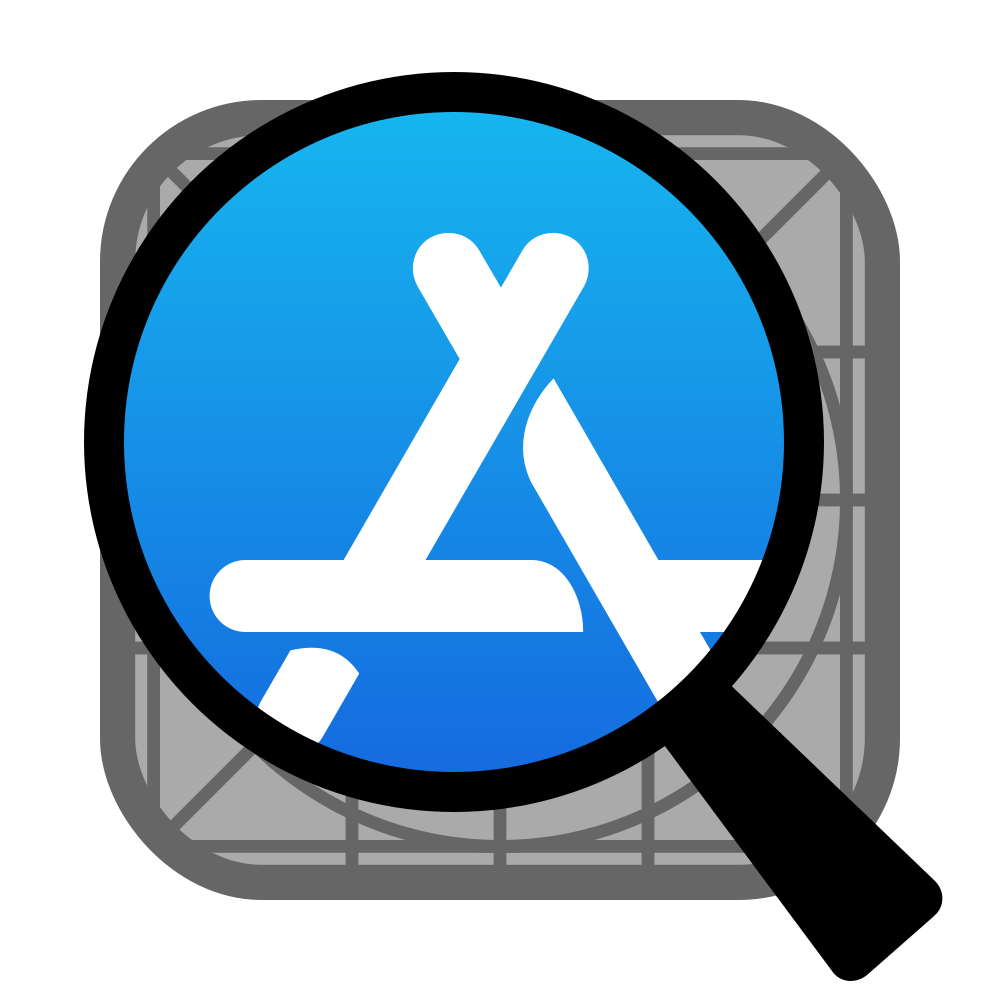
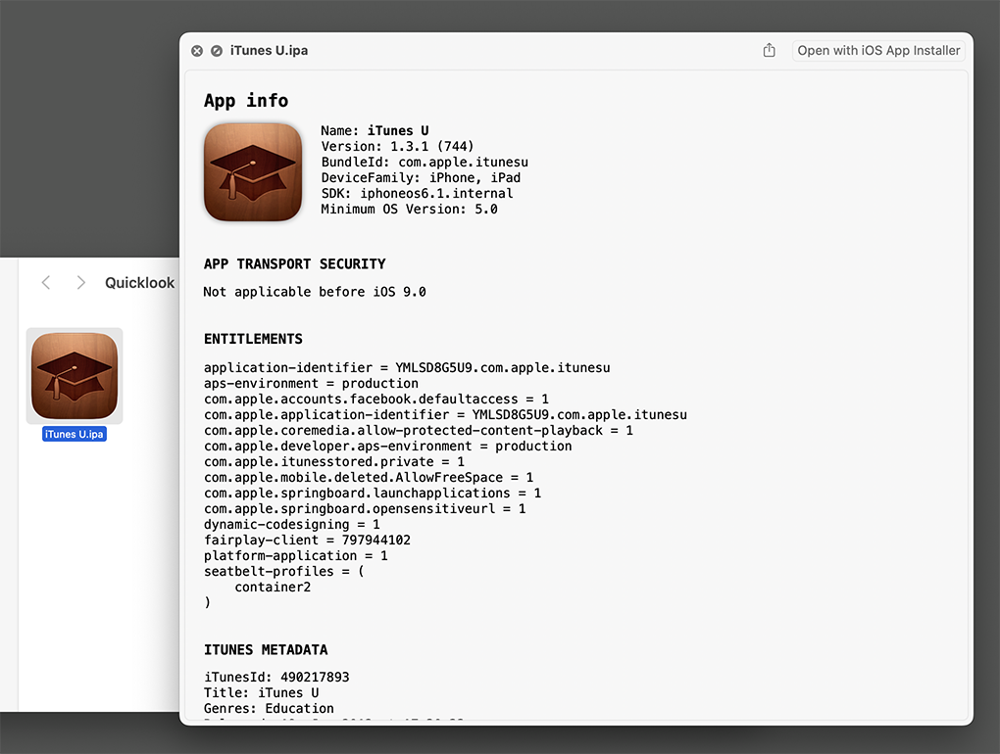
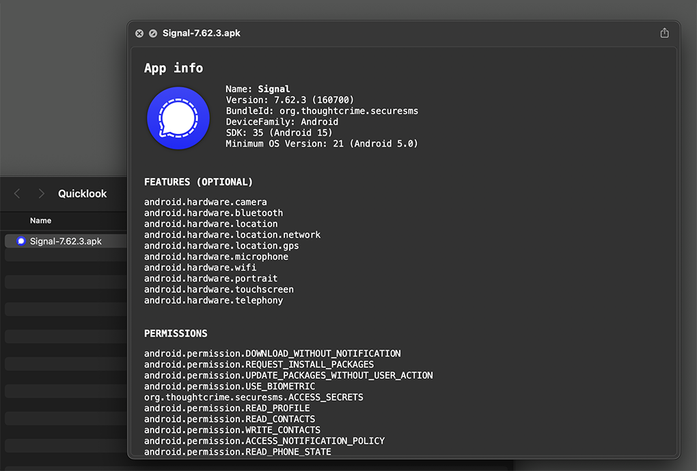

[](#)
[](https://github.com/relikd/QLAppBundle/releases/latest)
[](https://github.com/relikd/QLAppBundle/releases)




QLAppBundle
===========

QuickLook plugin for app bundles (`.ipa`, `.apk`, etc.).





Installation
------------

Requires macOS Catalina (10.15) or higher.

```sh
brew install --cask relikd/tap/qlappbundle
xattr -d com.apple.quarantine /Applications/QLAppBundle.app
```

or download from [releases](https://github.com/relikd/QLAppBundle/releases/latest).


Features
--------

- Support for: `.ipa`, `.tipa`, `.appex`, `.xcarchive`, `.apk`, `.apkm`
- Extensively tested on __a lot__ of archives (especially ipa's)
- No dependencies
- No external executable calls
- Small app size (3 MB)
- Customizable html output

### Customize HTML / CSS

1. Right click on the app and select "Show Package Contents"
2. Go to `PlugIns` and repeat "Show Package Contents" on the Preview extension.
3. Copy `Contents/Resources/template.html` (or `style.css`)
4. Open `~/Library/Containers/de.relikd.QLAppBundle.Preview/Data/Documents/`
5. Paste the previous file and modify it to your liking
6. `QLAppBundle` will use the new file from now on


Why?
----

I have been using [ProvisionQL][1].
In fact, I have contributed a lot of time and effort into a [pull request][2] to improve features and fix bugs.
But my PR is still open after 1 ½ years and there is still no support for macOS 15.
I know the author is working on it but it still takes too long for me.
So here it goes, my own fork to maintain.

This is not to devalue the original code, I highly respect the authors contribution for the general public.
I merely want things to be done.
Also, I've removed support for provisioning profiles (`.mobileprovision`, `.provisionprofile`) to focus on app bundles.


Development notes
-----------------

You can show Console logs with `subsystem:de.relikd.QLAppBundle`


[1]: https://github.com/ealeksandrov/ProvisionQL
[2]: https://github.com/ealeksandrov/ProvisionQL/pull/54
